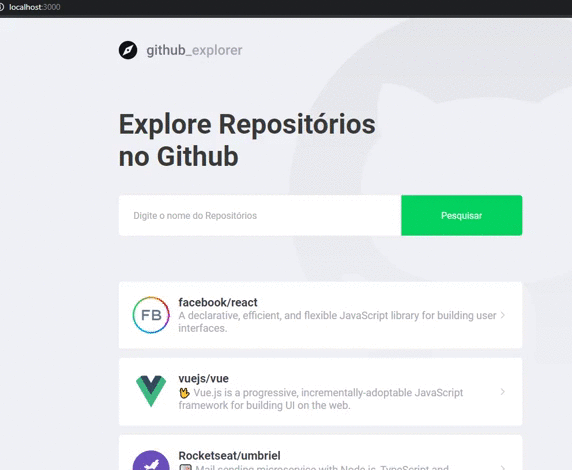

<h2 align="center">
  Git_Explore
</h2>

## 🚀 About
The application allows users seeking for some repository, save and list its issues.

## 🎨 Layout
<h4 align="center">

  

</h4>

## 🔨 Techs
[] ReactJS

## 📱 How To Use

```bash

# Clone this repository

$ git clone https://github.com/luisrodriguesds/git-explore.git

# Go into the repository

$ cd git-explore

# Install packages

$ yarn

# Run the application

$ yarn start


# Enjoy!

```

After this, you can develop and contact my from see your contrib and add credits for you in this repository :smile: 

---

Made with ♥ by Luis Rodrigues [Visit my LinkedIn!](https://www.linkedin.com/in/luis-rodrigues-064875174/) :rocket: